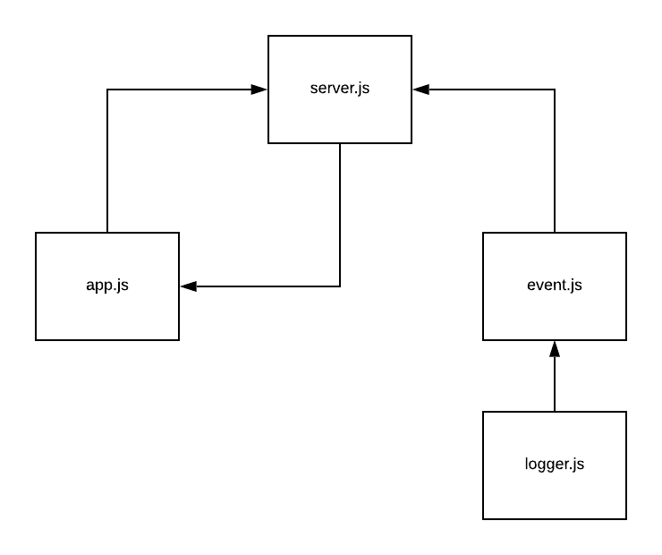

# LAB - 17

## TCP Server / Messaging Service

### Author: David Vloedman

### Links and Resources
* [submission PR](https://github.com/david-vloedman-401-advanced-javascript/401-lab-17/pull/1)
* [travis](https://www.travis-ci.com/david-vloedman-401-advanced-javascript/401-lab-17)

#### Documentation

* [JSDocs](./docs/index.html)

### Setup

* Clone repo
* npm install

#### `.env` requirements (where applicable)

* `PORT` - Port Number

#### How to initialize/run your server app (where applicable)

* npm start
  
#### Tests
* npm test

#### UML

